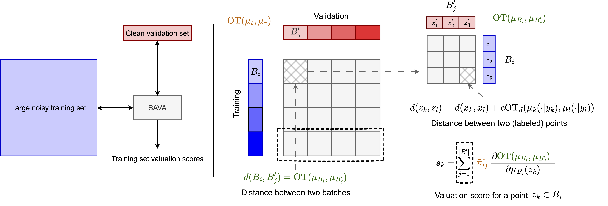

# SAVA: Scalable Learning-Agnostic Data Valuation

This repository contains code to reproduce the experiments in the paper "SAVA: Scalable Learning-Agnostic Data Valuation": [arXiv](https://arxiv.org/abs/2106.00007).

We propose SAVA: scalable model-agnostic algorithm for data valuation on labeled datasets by performing optimal transport hierarchically at both batch and data point levels.

This code base is forked from the [LAVA](https://github.com/ruoxi-jia-group/LAVA) we are immensely grateful to authors for open sourcing their code.

# Summary

We consider the problem of valuing data points from a large noisy training set, given a clean and curated validation dataset. We use optimal transport between labelled datasets to measure the distance between labelled points for classification problems. To make this data valuation scalable we use hierarchical optimal transport and solve the optimal transport problem at the level of a batch.




# CIFAR10 corruptions

The corruption type can be controlled by setting the `--corruption_type` flag which can be `shuffle` for noisy labels `feature` for the noisy feature corruption `poison_frogs` for poison detection `trojan_sq` for the trojan square detection. The corruption level can be controlled by setting the `--corrupt_por` arg.

## SAVA

To run SAVA on a subset of the CIFAR10 dataset we can use the following commands for the 4 different corruption types:

```py   
seed=0
python value_cifar10.py --hierarchical --random_seed=${seed} --corrupt_por=0.3 --corruption_type=shuffle --cache_l2l --tag=sava_labels_bs1024_cache_l2ls${seed} --cuda_num=0 --train_dataset_sizes 10000 --val_dataset_size 2000 --evaluate
```

```py
seed=0
python value_cifar10.py --hierarchical --random_seed=${seed} --corrupt_por=0.3 --corruption_type=feature --cache_l2l --tag=sava_feature_bs1024_cache_l2ls${seed} --cuda_num=1 --train_dataset_sizes 10000 --val_dataset_size 2000 --evaluate
```

```py
seed=0
python value_cifar10.py --hierarchical --random_seed=${seed} --corrupt_por=0.1 --corruption_type=poison_frogs --cache_l2l --tag=sava_poison_frogs_bs1024_cache_l2ls${seed} --cuda_num=2 --train_dataset_sizes 10000 --val_dataset_size 2000 --evaluate
```

```py
seed=0
python value_cifar10.py --hierarchical --random_seed=${seed} --corrupt_por=0.1 --corruption_type=trojan_sq --cache_l2l --tag=sava_trojan_sq_bs1024_cache_l2ls${seed} --cuda_num=3 --train_dataset_sizes 10000 --val_dataset_size 2000 --evaluate
```
## LAVA

To run LAVA on a subset of the CIFAR10 dataset we can use the following commands for the 4 different corruption types:

```py
seed=0
python value_cifar10.py --random_seed=${seed} --corruption_type=shuffle --corrupt_por=0.3 --feat_repr --tag=lava_labels_s${seed} --cuda_num=0 --train_dataset_sizes 10000 --val_dataset_size 2000 --evaluate
```

```py
seed=0
python value_cifar10.py --random_seed=${seed} --corruption_type=feature --corrupt_por=0.3 --feat_repr --tag=lava_feature_s${seed} --cuda_num=0 --train_dataset_sizes 10000 --val_dataset_size 2000 --evaluate
```

```py
seed=0
python value_cifar10.py --random_seed=${seed} --corruption_type=poison_frogs --corrupt_por=0.1 --feat_repr --tag=lava_poison_frogs_s${seed} --cuda_num=0 --train_dataset_sizes 10000 --val_dataset_size 2000 --evaluate
```

```py
seed=0
python value_cifar10.py --random_seed=${seed} --corruption_type=trojan_sq --corrupt_por=0.1 --feat_repr --tag=lava_trojan_sqs_s${seed} --cuda_num=1 --train_dataset_sizes 10000 --val_dataset_size 2000 --evaluate
```

## Batch-wise LAVA

To run Batch-wise LAVA on a subset of the CIFAR10 dataset we can use the following commands for the 4 different corruption types:

```py   
seed=0
python value_cifar10.py --random_seed=${seed} --corruption_type=shuffle --corrupt_por=0.3 --feat_repr --tag=batchwise_lava_labels_s${seed} --cuda_num=0 --batchwise_lava --cache_l2l --train_dataset_sizes 10000 --val_dataset_size 2000 --evaluate
```

```py   
seed=0
python value_cifar10.py --random_seed=${seed} --corruption_type=feature --corrupt_por=0.3 --feat_repr --tag=batchwise_lava_feature_s${seed} --cuda_num=0 --batchwise_lava --cache_l2l --train_dataset_sizes 10000 --val_dataset_size 2000 --evaluate
```

```py   
seed=0
python value_cifar10.py --random_seed=${seed} --corruption_type=poison_frogs --corrupt_por=0.1 --feat_repr --tag=batchwise_lava_poison_frogs_s${seed} --cuda_num=1 --batchwise_lava --cache_l2l --train_dataset_sizes 10000 --val_dataset_size 2000 --evaluate
```

```py   
seed=0
python value_cifar10.py --random_seed=${seed} --corruption_type=trojan_sq --corrupt_por=0.1 --feat_repr --tag=batchwise_lava_trojan_sq_s${seed} --cuda_num=1 --batchwise_lava --cache_l2l --train_dataset_sizes 10000 --val_dataset_size 2000 --evaluate
```

# Non-stationary incremental learning with CIFAR10

We incrementally add more data points to the CIFAR10 dataset over the course of 5 tasks, so we start with a dataset of size 10k, then 20k etc.

To run this with the noisy labels corruption with SAVA:

```py
seed=0
TAG=hot_labels
python main_nonstationary.py --tag=${TAG}_s${seed} --random_seed=${seed} \
    --corruption_type=shuffle --corrupt_por=0.3 \
    --prune_per=0.3 --hierarchical --val_dataset_size=0 \
    --cache_l2l --hot_batch_size=1024 --cuda_num=0
```

To run this with the feature corruption:

```py
seed=0
TAG=hot_feature
python main_nonstationary.py --tag=${TAG}_s${seed} --random_seed=${seed} \
    --corruption_type=feature --corrupt_por=0.3 \
    --prune_per=0.3 --hierarchical --val_dataset_size=0 \
    --cache_l2l --hot_batch_size=1024 --cuda_num=1
```

To run this with the noisy labels corruption with LAVA:

```py
TAG=lava_labels
seed=0
python main_nonstationary.py --tag=${TAG}_s${seed} --random_seed=${seed} \
    --corruption_type=shuffle --corrupt_por=0.3 \
    --prune_per=0.3 --cuda_num=2
```

```py
TAG=lava_feature
seed=0
python main_nonstationary.py --tag=${TAG}_s${seed} --random_seed=$seed \
    --corruption_type=feature --corrupt_por=0.3 \
    --prune_per=0.3 --cuda_num=3
```


# Clothing1M

The dataset can be obtained by e-mailing the authors to obtain access.

## SAVA

To run SAVA on Clothing1M we can use the following command which uses 8 GPUs (`--n_gpus`). We can also use the `--prune_percs` flag to prune the dataset at different levels.


```py
seed=0
python value_clothing1M.py --seed=${seed} --cuda_num=0 --n_gpu=8 --value_batch_size=2048 \
--tag=hot_hotbs2048_wd0002_s${seed} --hot --prune_percs 0.1 0.2 0.3 0.4 --train_batch_size=512 \
--wd=0.002 --values_tag=clothing1m_hot_values_resnet18_feat_extra_bs4096_hot_hotbs2048_s${seed}
```

## Batch-wise LAVA

To run Batch-wise LAVA on Clothing1M we can use the following command which uses 8 GPUs (`--n_gpus`). We can also use the `--prune_percs` flag to prune the dataset at different levels.

```py   
seed=0
python value_clothing1M.py --seed=${seed} --cuda_num=0 --n_gpu=8 --value_batch_size=2048 \
    --tag=batchwise_lava_bs2048_wd0002_s${seed} --batch_lava --prune_percs 0.1 0.2 0.3 0.4 --train_batch_size=512 \
    --wd=0.002 --values_tag=clothing1m_batch_lava_bs2048_s${seed}
```
# Citation

If you find this code useful in your research, please consider citing the following paper:

```
@misc{kessler2024sava,
      title={SAVA: Scalable Learning-Agnostic Data Valuation}, 
      author={Samuel Kessler and Tam Le and Vu Nguyen},
      year={2024},
      eprint={2406.01130},
      archivePrefix={arXiv},
      primaryClass={cs.LG}
}
```